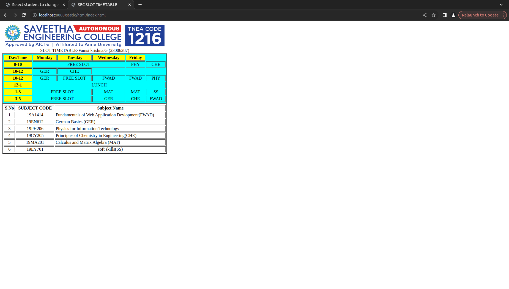

# Experiment_Time_Table

## AIM
To Write a html webpage page to display your timetable.

# ALGORITHM
### STEP 1
create a simple table using table tag
### STEP 2
Add header row using th tag
### STEP 3
Add your timetable
### STEP 4
Execute the program

# CODE
```html
<!DOCTYPE html>
<html lang="en">
<head>
    <title>timetable</title>
</head>
<body>
    
    <div style="padding-top: 20px; margin-left: 120px; font-size: larger; font-weight: bold;">SLOT TIMETABLE-SRI VIGNESH G(23012556)</div>
 <div style="font-size: medium; font-weight: bold; padding-left: 25px;">
    <table border="3" bgcolor="cyan" cellspacing="5" cellpadding="10px">
<TR bgcolor="yellow" >
    <TD>Day/Time</TD>
    <TD>Monday</TD>
    <TD>Tuesday</TD>
    <TD>Wednesday</TD>
    <TD>Thursday</TD>
    <TD>Friday</TD>
</TR>
<TR>
    <TD bgcolor="yellow" align="center">8-10</TD>
    <TD colspan="3" align="center">FREE SLOT</TD>
    <TD align="center">PHY</TD>
    <TD align="center">CHE</TD>
</TR>
<TR align="center" height="2.5%">
    <TD  bgcolor="yellow" align="center">10-12</TD>
    <TD>GER</TD>
    <TD>FREE SLOT</TD>
    <TD>FWAD</TD>
    <TD>FWAD</TD>
    <TD>PHY</TD>
</TR>
<TR  align="center">
    <TD  bgcolor="yellow" align="center">12-1</TD>
    <TD colspan="5">L U N C H</TD>
</TR>
<TR  align="center" font-weight="bold">
    <TD  bgcolor="yellow" align="center">1-3</TD>    
    <TD colspan="2">FREE SLOT</TD>
    <TD>PHY</TD>
    <TD>PHY</TD>
    <TD>SS</TD>
</TR>
<TR align="center" FONT-WEIGHT="bold">
    <TD bgcolor="yellow" align="center">1-3</TD>
    <td colspan="2">FREE SLOT</td>
    <td>GER</td>
    <td>CHE</td>
    <td>FWAD</td>
</TR>
</table>
 </div>
<div style="padding: 25px;">
<table border="3" cellspacing="5px" cellpadding="5px" width="579px"  >
    <tr align="center" style="font-weight: bold;">
        <td>S. NO.</td>
        <td>Subject Code</td>
        <td>Subject Name</td>
    </tr>
    <tr align="center">
        <td>1.</td>
        <td>19AI414</td>
        <td>Fundamentals of web application development(FWAD)</td>
    </tr>
    <tr align="center">
        <td>2.</td>
        <td>19EN612</td>
        <td>German Basic(GER)</td>
    </tr>
    <tr align="center">
        <TD>3.</TD>
        <TD>19PY206</TD>
        <TD>Physics for Information Technology(PHY)</TD>
    </tr>
    <tr align="center">
        <td>4.</td>
        <td>19CY205</td>
        <td>Principle of Chemistry in Engineering(CHE)</td>
    </tr>
    <tr align="center"><td>5.</td>
    <td>19MA201</td>
    <td>Calculus and Matrix Algebra(MAT)</td></tr>
    <tr align="center">
        <td>6.</td>
        <td>19EY701</td>
        <td>Soft Skills(SS)</td>
    </tr>
</table>
</div>
</body>
</html>
```
# OUTPUT



